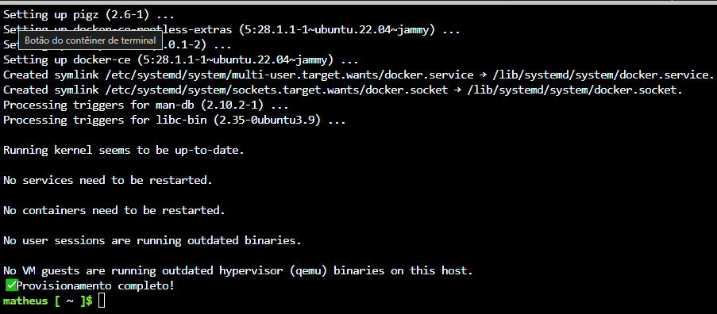

## Criando a máquina virtual

- Baixe o arquivo `criar_vm.sh`
- Importe para o Cloud Shell da Azure

### Execute os seguintes comandos:
1. Permitir acesso para qualquer usuário do sistema:
```bash
chmod +x criar_vm.sh
```
2. Em seguida, execute o seguinte comando para rodar o script:  
```bash
./criar_vm.sh
```

---

Ao inciar a instalação do `DOCKER` na VM o terminal irá pedir uma senha, digite o valor da variável `ADMIN_PASSWORD`  

Ao final do script será exibir a mensagem `✔ Provisionamento completo!`  



### Pronto sua VM com Docker está criada 
Agora basta acessar a VM via `SSH` e baixar os arquivos da api:
```bash
sudo apt-get update
sudo apt-get install -y git
git clone https://github.com/MatheusGmota/dashmottu-api.git
cd dashmottu-api
sudo apt-get install -y maven
```

### Executando o Dockerfile
```bash
docker build -t dashmottu .
```
### E executar o contêiner com:
```bash
docker run -e ORCL_URL=jdbc:oracle:thin:@{host}:1521:orcl \
           -e ORCL_USERNAME={seuUsuario} \
           -e ORCL_PASSWORD={suaSenha} \
           -p 8080:8080 \
           dashmottu-api
```